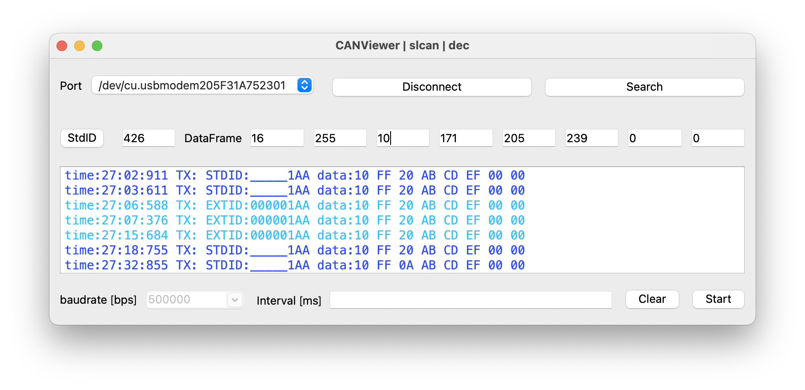
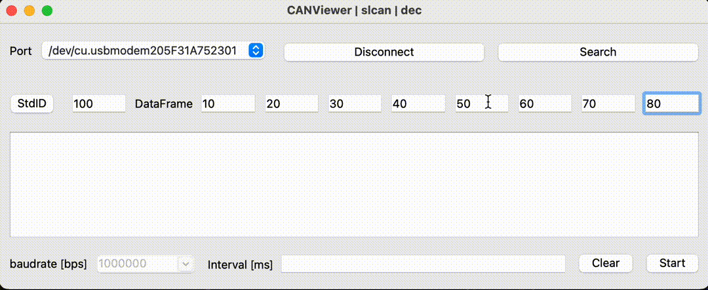
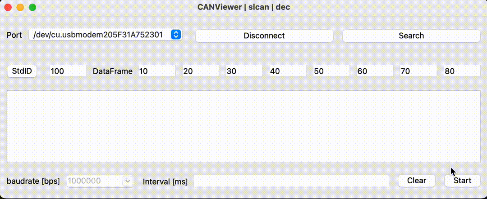
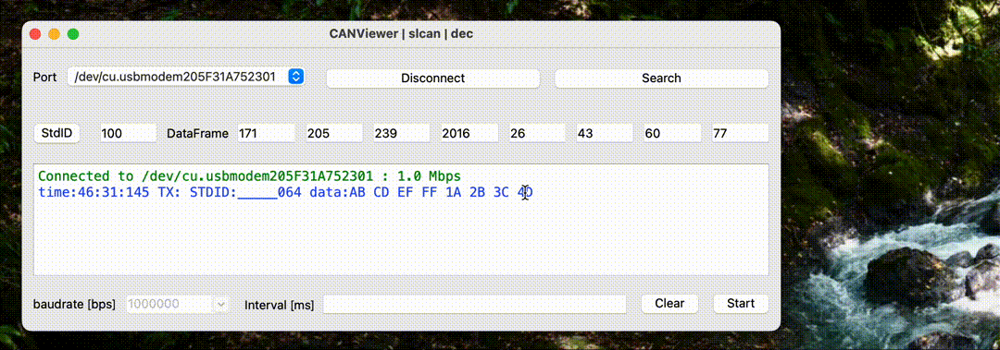
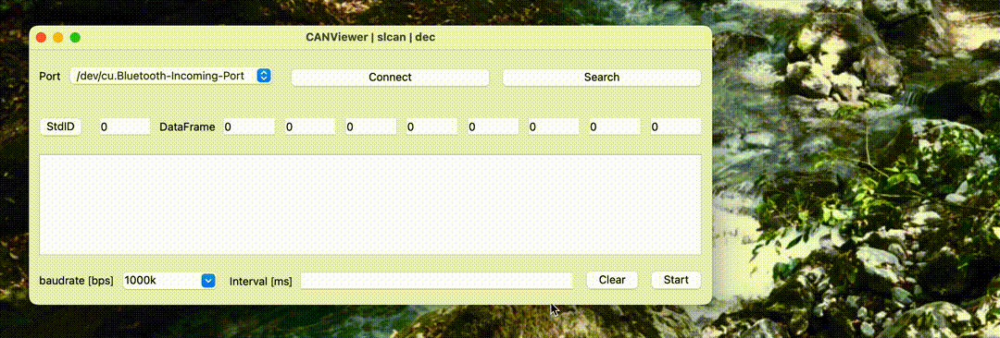

<div align="center">
    
    <h1>CANViewer</h1>
    <p>cross-platform CAN bus monitor, built on Python.</p>

  [](https://github.com/TomiXRM/CANViewer/blob/main/LICENSE)
  [](https://github.com/TomiXRM/CANViewer/stargazers)
  [](https://github.com/TomiXRM/CANViewer/issues)
  [](https://github.com/TomiXRM/CANViewer/releases)
</div>



このアプリケーションは、SLCANやgs_usb対応CANデバイスをPCに接続し、PCから手軽にCAN通信を検証できるツールです。
CANバス上に流れるデータの受信、定期送信や単発送信、標準IDと拡張IDの切り替え、10進数↔️16進数変換に対応しています。
Pythonベースで書かれているためMac,Ubuntu,Windows動作します。

## App Downloads

[Releases](https://github.com/TomiXRM/CANViewer/releases)からビルド済みアプリケーションがダウンロードできます。Windows,Mac,Linux(バイナリ)で動作します。

## CANViewerの機能

- **単発送信** : `Interval`に入力せずに`Start`ボタンを押す
- **インターバル送信** : `Interval`にインターバル送信したい間隔(ミリ秒)を入力して`Start`ボタンを押す
- **標準/拡張フォーマットの切り替え** : `StdID`/`ExtID`のクリックでフォーマットの切り替え
- **入力進数変更** : `DataFrame`のラベルをクリックすることで切り替え可能。また`Ctrl+H(J)`でHEX、`Ctrl+D(F)`でDECへの入力メソッド切り替えが可能
- **フィルタ機能** : `Ctrl+P`でProモードに切り替わります。Proモードではフィルタ設定用のテーブルが表示され、無視したいIDを入力することで、指定したIDのメッセージがログから非表示になります。(現在Proモードはフィルタ機能のみ実装されています)

### インターバル送信



### 標準ID/拡張IDフォーマット切り替え



### 入力フォーマットの10進数(DEC),16進数(HEX)切り替え



### 無視したいIDのフィルタ機能



## Development Prerequisites / 開発に必要なもの

- CANデバイスが用意されていること(SLCANまたはgs_usbであれば[CANable2.0](https://canable.io)や[MKS CANable](https://ja.aliexpress.com/item/1005003746105255.html)など)
- Pythonがインストールされていること
  - [uv](https://docs.astral.sh/uv/)がインストールされていない場合は、事前にインストールする必要があります。macOSでは`brew install uv`でインストールできます。
  - uvを使用して依存関係を解決することで、Pythonアプリケーションの実行に必要なパッケージが自動的にインストールされます。
- `make`が入っていると便利です

メンテナンス用コマンド、依存関係更新、CI、リリースビルドについては[Development Guide](./docs/development.md)を参照してください。

## ビルド方法

1. ターミナルを開きます。
2. Pythonアプリケーションが格納されているディレクトリに移動します。

    ``` bash
    cd CANViewerのディレクトリ
    ```

3. uvを使用して依存関係を解決し、仮想環境を作成します。

    ``` bash
    uv sync --all-groups
    ```

   または

   ``` bash
   make install
   ```

4. アプリケーションを起動します。

    ``` bash
    uv run python main.py
    ```

    または

    ``` bash
    make run
    ```

5. gs_usbで動作させる場合のオプション

   ``` bash
   uv run python main.py -c gs_usb
   ```

## アプリケーションバンドルのビルド

macOSでは `dist/CANViewer.app` が生成されます。

``` bash
make build
```

`dist/CANViewer.dmg` も生成する場合:

``` bash
make build-dmg
```

Linuxでは `dist/CANViewer-<arch>.AppImage` が生成されます。

``` bash
make build-appimage
```

AppImageを `~/.local/bin` に配置し、desktop entryに登録する場合:

``` bash
make install-linux-desktop
```

## ライセンス

このプロジェクトはLGPLライセンスです。 詳しくは[LICENSE](LICENSE)を確認ください
