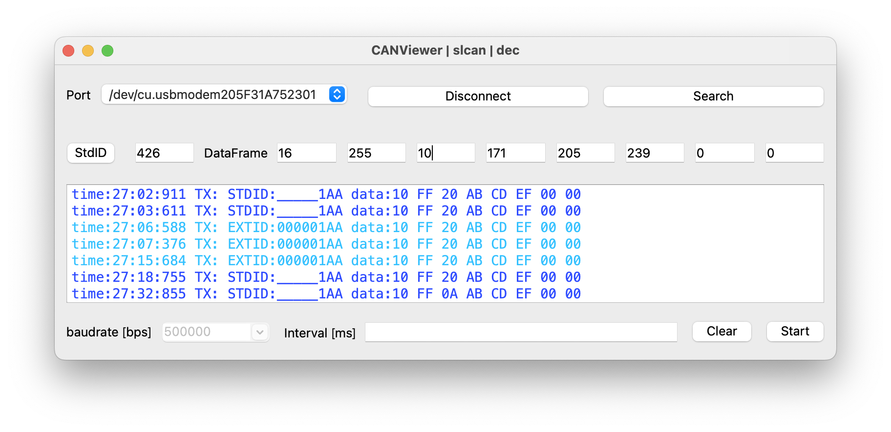

# CANViewer
CANAble2.0でCANをしゃべるくん


# **前提条件**

- Pythonがインストールされていること
- Poetryがインストールされていること
- PythonアプリケーションがPoetryで管理されていること

[GitHub - TomiXRM/CANViewer: CANAble2.0でCANをしゃべるくん](https://github.com/TomiXRM/CANViewer)

# 使用方法

1. ターミナルを開きます。
2. Pythonアプリケーションが格納されているディレクトリに移動します。
    
    ```bash
    cd path/to/your/python/application
    ```
    
3. Poetryを使用して依存関係を解決し、仮想環境を作成します。
    
    ```
    poetry install
    ```
    
4. アプリケーションを起動します。
    
    ```arduino
    poetry run python main.py
    ```
    

# **注意事項**

- Poetryがインストールされていない場合は、事前にインストールする必要があります。
- Poetryを使用して依存関係を解決することで、Pythonアプリケーションの実行に必要なパッケージが自動的にインストールされます。
- **`poetry run`**を使用することで、Poetryが管理する仮想環境内でPythonアプリケーションを実行します。