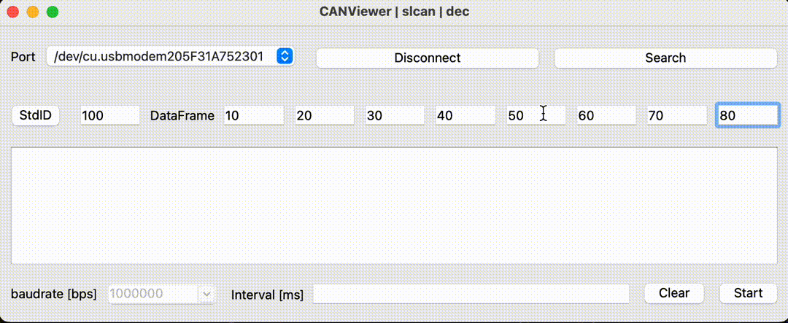
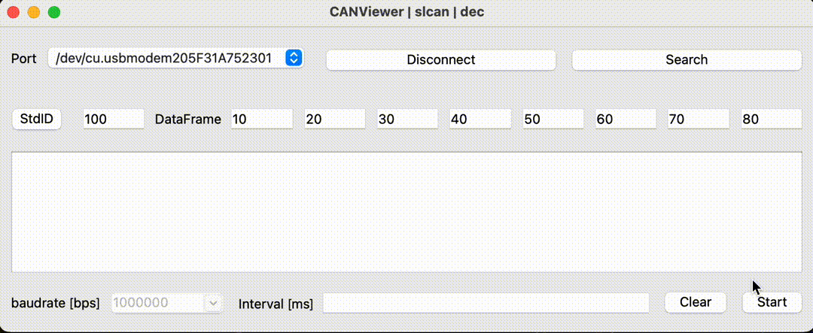
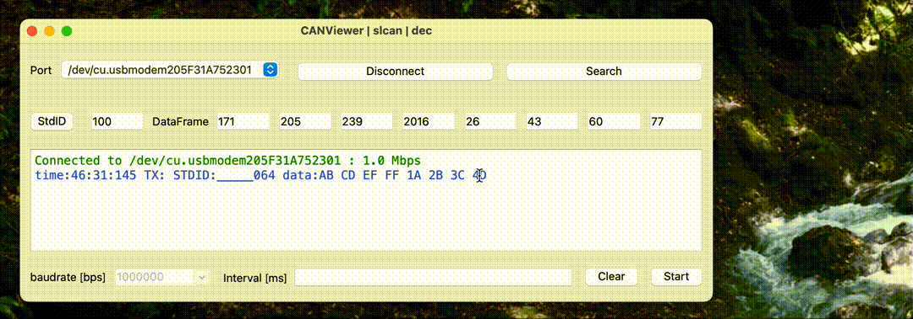
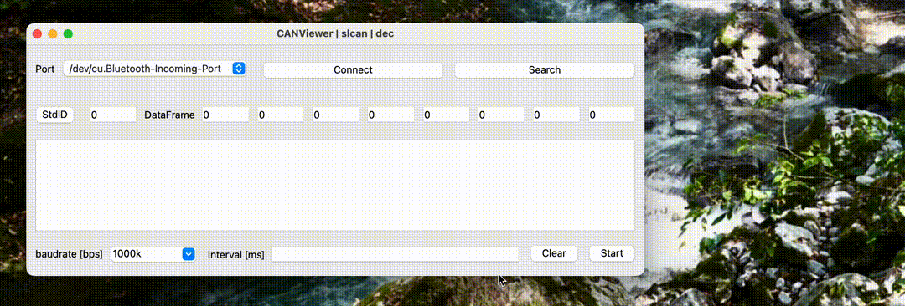

<div align="center">
    
    <h1>CANViewer</h1>
    <p>cross-platform CAN bus monitor, built on Python.</p>

  [](https://github.com/TomiXRM/CANViewer/blob/main/LICENSE)
  [](https://github.com/TomiXRM/CANViewer/stargazers)
  [](https://github.com/TomiXRM/CANViewer/issues)
  [](https://github.com/TomiXRM/CANViewer/releases)
</div>


日本語の説明は[こちら](./README.jp.md)

---

This application is a tool that connects an SLCAN or SocketCAN device to a PC and allows you to easily verify CAN communication from your PC.
It supports receiving data flowing on the CAN bus, periodic and one-time transmission, switching between standard and extended IDs, and decimal to ↔️ hexadecimal conversion.
It is written in Python and runs on Mac, Ubuntu, and Windows (SocketCAN is only supported on Ubuntu).

## App Downloads

You can download a pre-built application from [Releases](https://github.com/TomiXRM/CANViewer/releases). It runs on Windows, Mac and Linux (binary).

## CANViewer Features

- **Single-shot transmission** : press `Start` button without entering `Interval
- **Interval transmission** : Input the interval (in milliseconds) you want to transmit interval in `Interval` and press `Start` button.
- **Switch standard/extended format** : Click `StdID`/`ExtID` to switch format
- **Change input decimal number** : Click `DataFrame` label to switch. Also, you can switch input method to HEX by `Ctrl+H(J)` and to DEC by `Ctrl+D(F)`.
- **Filter function** : `Ctrl+P` switches to Pro mode; in Pro mode, a table for filter settings is displayed, and by entering an ID to be ignored, messages with the specified ID are hidden from the log. (Currently, only the filter function is implemented in Pro mode.)

### Interval transmission



### Switch between standard ID and extended ID formats



### Switch input format between decimal(DEC) and hexadecimal(HEX)



### filter function for IDs you want to ignore



## Development Prerequisites / What you need for development

- CAN device must be available (for SLCAN, [CANable2.0](https://canable.io) or [MKS CANable](https://ja.aliexpress.com/item/1005003746105255.html))
- Python must be installed.
  - If [Poetry](https://python-poetry.org) is not installed, it must be installed beforehand. (It is used for version control of libraries)
  - Resolving dependencies using Poetry will automatically install the packages needed to run your Python application.
- It is useful to have `make` included!

## How to build

1. Open in terminal
2. Go to the directory where the CANViewer Python application is stored.

    ``` bash
    cd CANViewer-directory
    ```

3. Use Poetry to resolve dependencies and create virtual environments.

    ``` bash
    poetry install
    ```

   or

   ``` bash
   make install
   ```

4. Launch the application with command.

    ``` bash
    poetry run python main.py
    ```

    or

    ``` bash
    make run
    ```

5. Options for operating with SocketCAN

   ``` bash
   poetry run python main.py -c socketcan
   ```

## LICENSE

This project is LGPL licensed. Please check [LICENSE](LICENSE) for more information.